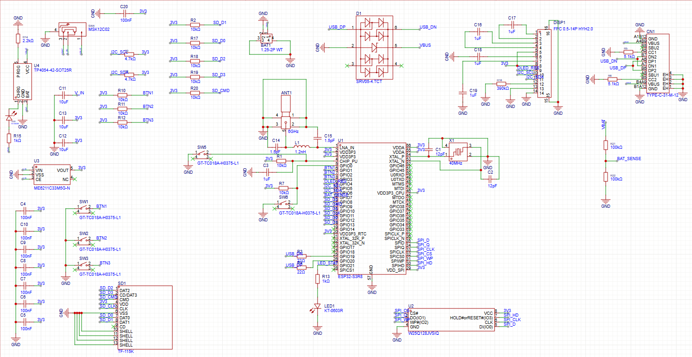

# ESP32-S3 Development Board

Custom development board based on the ESP32-S3 microcontroller.

## Overview

This project is a custom embedded hardware platform designed around the ESP32-S3 microcontroller.  
The board integrates external flash memory, microSD storage and USB connectivity.

## Features

- ESP32-S3 microcontroller
- SPI Flash memory (W25Q128)
- microSD card interface
- USB Type-C connectivity
- 40 MHz crystal oscillator
- 2.4 GHz antenna section
- 3.3V power regulation

## Interfaces

- SPI
- UART
- I2C
- SDIO
- USB

## Hardware

The design includes external flash memory connected via SPI and a microSD card interface for data storage.  
USB Type-C is used for communication and power.

## Schematic

## Tools

- PCB design: Eagle CAD
